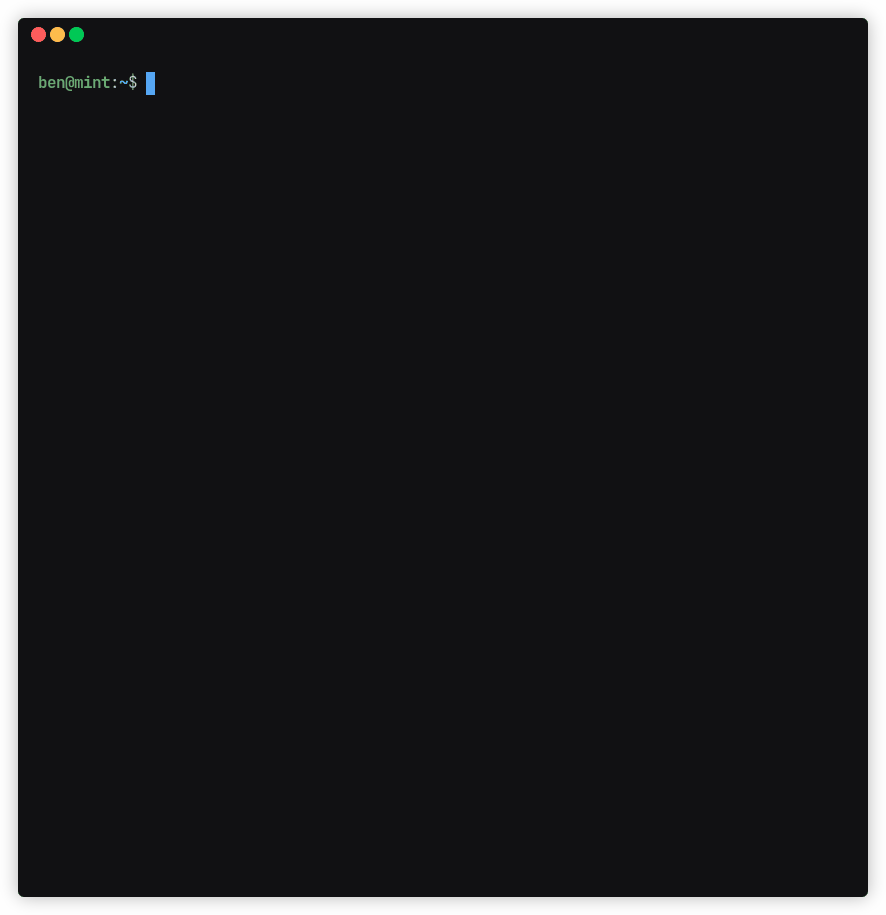

# dynq

`dynq` is an analytic query and data processing CLI tool for DynamoDB. It uses [`jq`](https://jqlang.github.io/jq/)
filters to target, transform and/or aggregate items in a given table, and has a number of QoL features including
automatic pagination, segmentation and index expansion.



## Build from source

```shell
docker compose up -d
docker/dynq-build/mvn verify

```

## Options

#### `-f, --from`

(table name)

*Required*

The name of the table containing the requested items; or, if you provide `--index`, the name of the
table to which that index belongs.

#### `-c, --concurrency`

(integer)

The number of coroutines to launch when reading from DynamoDB. Defaults to `1`.

For scan operations, this option is equivalent to the DynamoDB `--total-segments` option. The optimal number will
depend on the size and composition of the table.

For non-scan operations, this option is only applicable if multiple keys are passed.

Incompatible with `--scan-limit` and `--start-key`.

#### `-i, --index`

(index name)

The name of a global secondary index to query.

Requires `--partition-key`.

Incompatible with `--consitent-read`.

#### `-x, --expand`

Retrieve non-projected attributes from the primary table when querying a global secondary index.

Requires `--partition-key` and `--index`.

#### `-s, --select`

(projection expression)

A comma-separated set of attribute names to retrieve. Equivalent to the DynamoDB `--projection-expression` option.

Can improve performance of queries.

#### `-e, --stream`

Incrementally write items to stdout.

Incompatible with `--aggregate`, `--reduce`, `--prune` and `--meta-only`.

#### `--consistent-read`

Guarantees that all writes completed before the query began will be processable.

#### `-E, --endpoint-url`

(url)

Send DynamoDB requests to the given URL.

#### `-p, --profile`

(aws profile)

Profile to use from your AWS credentials file.

#### `-R, --region`

(aws region)

The AWS region to use. Overrides config/env settings.

### Selection filters

#### `-w, --where`

(jq filter)

`jq` predicate filter to select items. Equivalent to `jq` [`select(f)`](https://jqlang.github.io/jq/manual/v1.6/#select)
function.

#### `-P, --partition-key`

(jq filter)

`jq` filter producing one or more partition keys to query.

The output must be an object containing a single key (the partition key attribute name), the value of which must be a
string, number, or array thereof.

Binary keys are not currently supported.

#### `-S, --sort-key`

(jq filter)

`jq` filter producing one or more sort keys or a sort key range to query.

The output must be an object containing a single key (the sort key attribute name).

To target specific items, the value must be a string, number, or array thereof.

To target a range of items, the value must be an object with exactly one of the following operator keys:

- `lt` or `less_than`
- `lte` or `less_than_or_equals`
- `gt` or `greater_than`
- `gte` or `greater_than_or_equals`
- `begins_with`
- `between`

Operand values must be a string or number. Each operator expects a single operand, except `between` which expects an
array containing a lower and upper bound (both inclusive).

Binary keys are not currently supported.

Requires `--partition-key`.

Incompatible with `--start-key`.

#### `-k, --start-key`

(jq filter)

`jq` filter producing the last evaluated key from a previous DynamoDB scan or query operation. When applicable,
`dynq` will return the last evaluated key of any such operations via the `meta.lastEvaluatedKey` field.

If a partition key has already been passed via the `--partition-key` option, then this filter does not need to output
one.

Binary keys are not currently supported.

Incompatible with `--sort-key` and `--concurrency`.

### Transformation filters

#### `-t, --transform`

(jq filter)

`jq` filter to transform individual items. Executes after the `--where` selection filter.

Incompatible with `--meta-only`.

#### `-T, --pretransform`

(jq filter)

`jq` filter to transform each individual item. Executes before the `--where` selection
filter.

#### `-a, --aggregate`

(jq filter)

`jq` filter to transform the complete query result set, after all other transformations and exclusions have been
applied. The output of this filter is returned to the user via the `content` field.

The total hit count of the query can be accessed in this filter using the `$count` variable. This is useful when the
result set has been transformed by the `--reduce` filter.

Incompatible with `--stream` and `--meta-only`.

#### `-u, --prune`

(jq filter)

`jq` filter to transform the cumulative result set, executed after each request to DynamoDB. Must return an array.

This filter can be used to find the least/greatest *n* values according to some comparator, or find distinct values.

Where possible, it should be used over `--aggregate` for high-volume queries to reduce memory usage.

Incompatible with `--meta-only`.

#### `-r, --reduce`

(starting value) (jq filter)

Reduce items using the given starting value and `jq` filter, with items assigned to `$item`.

Equivalent to `jq`
[`reduce .[] as $item (<starting value>; <jq filter>)`](https://jqlang.github.io/jq/manual/v1.6/#reduce)

Incompatible with `--stream`, `--prune` and `--meta-only`.

### Limits

#### `-l, --limit`

(integer)

The maximum number of DynamoDB items to retain after selection.

Note that `meta.lastEvaluatedKey` will not be returned when this option is given.

#### `-L, --scan-limit`

(integer)

The maximum number of DynamoDB items to scan across one or more requests.

Unlike `--limit`, `meta.lastEvaluatedKey` will be returned when this option is given unless all items have been scanned.

#### `-Q, --request-limit`

(integer)

The maximum number of requests to send to DynamoDB per coroutine.

#### `-I, --items-per-request`

(integer)

The maximum number of items scanned per DynamoDB request.

### Output flags

#### `--content-only`

Return only the content of the query output.

Incompatible with `--meta-only`.

#### `--meta-only`

Return only the metadata of the query output.

Incompatible with `--content-only`, `--transform`, `--aggregate`, `--prune`, `--reduce`, `--rearrange-keys`
and `stream`.

#### `-q, --quiet`

Only write to stderr when an error is encountered.

#### `-C, --colorize`

Colorize JSON output. Enabled by default when destination is a TTY.

Incompatible with `--monochrome`.

#### `-M, --monochrome`

Do not colorize JSON output. Enabled by default if destination is not a TTY.

Incompatible with `--colorize`.

#### `-m, --compact`

Compact instead of pretty-printed output.

#### `-g, --rearrange-keys`

Sort keys of objects on output.

Incompatible with `--meta-only`.

## Examples

The examples below are run against a single-table conversion of
the [PostgreSQL DVD rental sample database](docs/dvdrental-er.pdf).

### Queries

For brevity, these queries do not use the `--select` option, but its use is recommended for high-volume queries.

#### Find a `film` with a `G rating`

```shell
dynq --from dvd_rental \
  --partition-key '.entity = "film"' \
  --where '.rating == "G"' \
  --limit 1
```

[Output](docs/examples/g-rated-film.json)

> [!TIP]  
> The `--partition-key` filter above uses assignment to produce an object, however a JSON or JSON5 object literal may
> be used instead:
>
> ```shell
> --partition-key: '{ entity: "film" }'
> ```

#### Calculate total `amount` of `payments` in `2007-03`

Using `--transform` and `--aggregate`

```shell
dynq --from dvd_rental \
  --partition-key '.entity = "payment"' \
  --where '.payment_date | startswith("2007-03")' \
  --transform '.amount' \
  --aggregate 'add'
```

Using `--reduce`

```shell
dynq --from dvd_rental \
  --partition-key '.entity = "payment"' \
  --where '.payment_date | startswith("2007-03")' \
  --reduce 0 '. + $item.amount'
```

[Output](docs/examples/total-amount-paid-2007-03.json)

#### Calculate average `payment amount`

Using `--transform` and `--aggregate`

```shell
dynq --from dvd_rental \
  --partition-key '.entity = "payment"' \
  --transform '.amount' \
  --aggregate 'add / length'
```

Using `--reduce` and `--aggregate`

```shell
dynq --from dvd_rental \
  --partition-key '.entity = "payment"' \
  --reduce 0 '. + $item.amount' \
  --aggregate '. / $count'
```

[Output](docs/examples/average-payment-amount.json)

#### Find the `film` with the longest `length`

```shell
dynq --from dvd_rental \
  --partition-key '.entity = "film"' \
  --prune '[max_by(.length)]'
```

[Output](docs/examples/longest-film.json)

#### Find the three `films` with the shortest `length`

```shell
dynq --from dvd_rental \
  --partition-key '.entity = "film"' \
  --prune 'sort_by(.length)[:3]'
```

[Output](docs/examples/three-shortest-films.json)

#### Count `films` by `rating`

```shell
dynq --from dvd_rental \
  --partition-key '.entity = "film"' \
  --reduce '{}' '.[$item.rating] += 1'
```

[Output](docs/examples/film-count-by-rating.json)

#### Find `inventory` for `film_id 1` using the `film_id` index

```shell
dynq --from dvd_rental \
  --partition-key '.film_id = 1' \
  --where '.entity == "inventory"' \
  --index 'film_id' \
  --expand
```

[Output](docs/examples/film-1-inventory.json)

#### Scan from `rental 1`

```shell
dynq --from dvd_rental \
  --start-key '{ entity: "rental", id: 1 }'
```

#### Get `films` up to `film 100`

```shell
dynq --from dvd_rental \
  --partition-key '.entity = "film"' \
  --sort-key '.id.less_than = 100'
```

#### Find all `staff`, `customers` and `actors` named `Jon`

```shell
dynq --from dvd_rental \
  --partition-key '.entity = ["staff", "customer", "actor"]' \
  --where '.first_name == "Jon"'
```

[Output](docs/examples/jons.json)

### Redirection

#### Write each item to a file

```shell
dynq -em -f dvd_rental | while read item; do echo "$item" > $(uuid).json; done
```

#### Decode a binary attribute

```shell
dynq -e -f dvd_rental -P '.entity = "staff"' -S '.id = 1' -t '.picture' \
  | jq -r \
  | base64 -d \
  > staff_1.png
```
